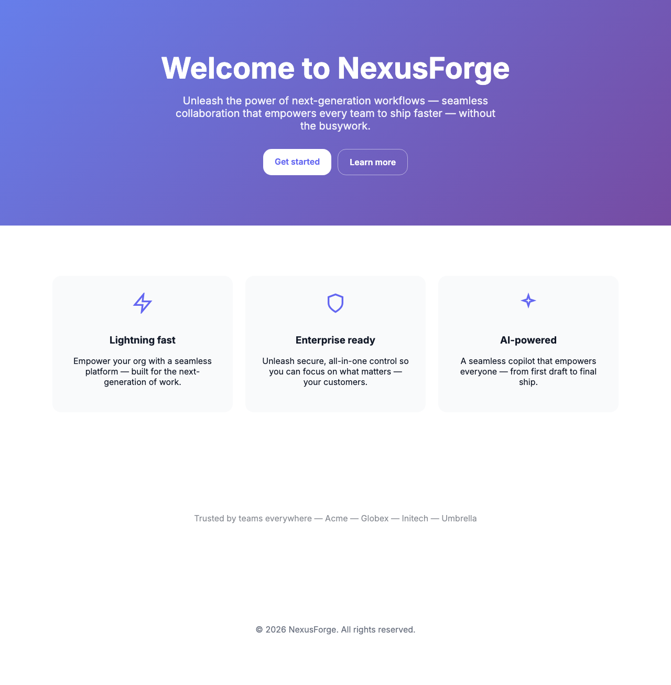

# aftertaste

taste-skill tells the agent to have taste. **aftertaste** checks whether it did.

A Playwright screenshot plus a deterministic slop audit. No API key. Score 100 is human and distinct; 0 is peak template.

    npx aftertaste http://localhost:5173

## What it is

A CLI critic. It opens a URL in Chromium, saves a PNG under `.aftertaste/`, and scores the page 0-100 from CSS and copy. 100 is distinct. 0 is peak template. No model API key.

## vs taste-skill

taste-skill (Leonxlnx/taste-skill) is an instruction: it tells the agent how to design before it writes CSS.

aftertaste is a critic: it looks at what shipped. Use taste-skill while generating. Run aftertaste against the preview URL when you think you are done.

## What it flags

Evidence is actual CSS and copy from the page:

- Fonts: Inter, Roboto, Arial, system-ui-only, Space Grotesk, Plus Jakarta Sans as the whole identity
- Palette: purple/indigo gradient, gray-50 cards, a single accent
- Layout: three equal feature cards, centered hero plus Get started / Learn more, Lucide row, identical section padding, radius 12/16 everywhere
- Copy: Welcome to, unleash, seamless, next-generation, empower, em dash spam, generic H1
- Motion: none, or the same fade-in on every block

`demo` audits `demo/slop.html` (the median AI landing). `demo/craft.html` is the control: a page that actually chose type, color, and structure.

`--skill` writes `.cursor/skills/aftertaste/SKILL.md` with facts from this URL: the font stack, the gradient, the H1, the three cards. Not generic design advice.

`--json` prints the result as JSON. `--fail-under N` exits 1 when the score is below N (CI).

## License

MIT

## Command

    aftertaste http://localhost:5173
    aftertaste demo
    aftertaste http://localhost:5173 --json
    aftertaste http://localhost:5173 --skill

Prefix with npx. Node 20+. Install Chromium via Playwright once.

Scorer tests live in `test/score.test.ts` (fixtures, no network).

---

## 中文

aftertaste 是命令行验收：打开页面、截图、用启发式规则给「AI 套模板」打分。不需要模型 API。

taste-skill 是生成前的设计约束；aftertaste 是生成后的检查。对预览地址跑一次，低分会列出真实的字体、色值和文案，而不是「请更有品味」。

See `.github/workflows/aftertaste.yml` for a workflow that comments the score on a pull request. `action.yml` is a composite wrapper.
